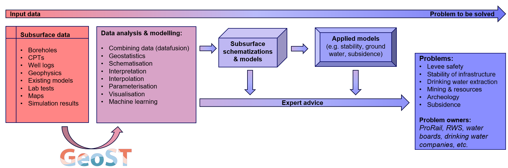
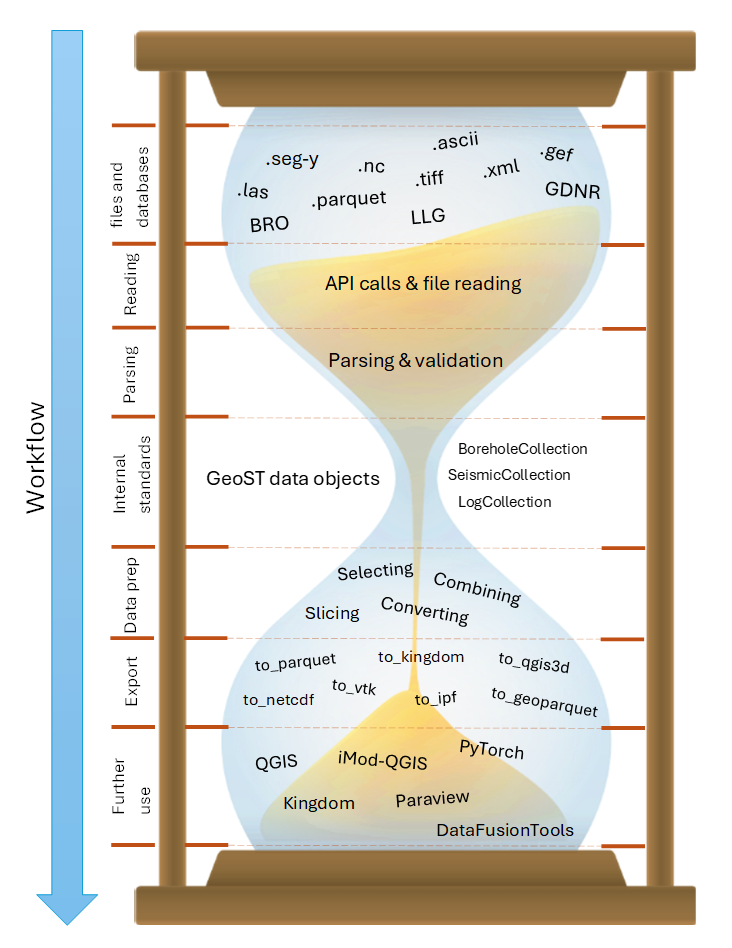

# About GeoST
```{toctree}
---
maxdepth: 2
caption: About
hidden:
---
```

Subsurface data lie at the basis of solving problems on topics of levee safety, stability
of infrastructure, drinking water extraction, (sand) mining, subsurface energy systems,
archeology, CO2 storage, subsidence, contanimation and the list goes on. Subsurface data is used by experts 
to advice on solutions, to visualize and explain subsurface data in the context of the
above-mentioned topics and most importantly to create tailor-made schematizations of the 
subsurface that directly serve as an input for calculating and mapping stability, subsidence, 
groundwater flow, thermal properties, subsurface resources etc. 

At Deltares, where the development of GeoST was initiated, we realized that using subsurface data
to solve these real-world and often high-stake problems requires good, reproducible and thoroughly
tested workflows all the way from subsurface data sources (BRO, GDNR, local files) to the 
inception of e.g. 3D subsurface models. GeoST is an important part of our answer to this as 

As Python is most often used for data analysis, statistical and modelling tasks, GeoST is 
set up to function as a Python interface for subsurface data. As shown in the figure below,
it is aimed at bridging the gap between subsurface data sources and all the analyses, 
visualisation and modelling efforts that follow. Simple visualisations and analyses may 
directly be used to give expert advice or subsurface data can be used to create more 
advanced schematizations and models that serve as an input for applied models.

<p align="left">
    
</p>

## Design philosophy
The design GeoST can best be described as an hourglass. At the top of this hourglass are
the many different sources through which subsurface data are distributed. This information 
is read, parsed, validated and subsequently stored in standarized data objects (the neck
of the hourglass). From here the user can apply basic and commonly used functionality on
the loaded data. Think of making selections, combining data, conversions, slicing operations etc.
The results can then be exported to various formats and/or be further used in different
softwares and tools, depending on the task at hand. 

At the basis of the internal data structures lie simple Pandas DataFrames, allowing the 
more advanced user to go far beyond the standard set of methods that GeoST offers.

<p align="center">
    
</p>

## Current development strategy
GeoST is being developed incrementally based on project needs. This means that every time
we require certain functionality within a project, we identify which part of this
functionality is eligible for addition to GeoST. This part is then developed to the high 
coding, testing and documentation standards that we require for GeoST. This may take more 
resources at first, but will pay itself of as the developed functionality is reused in
other projects. 