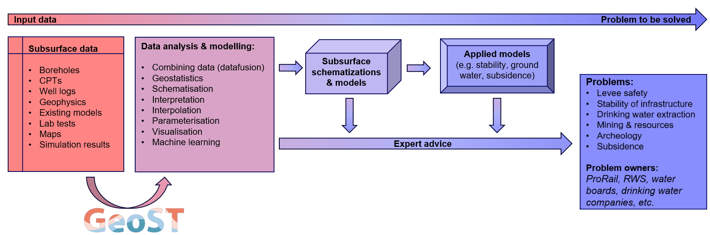
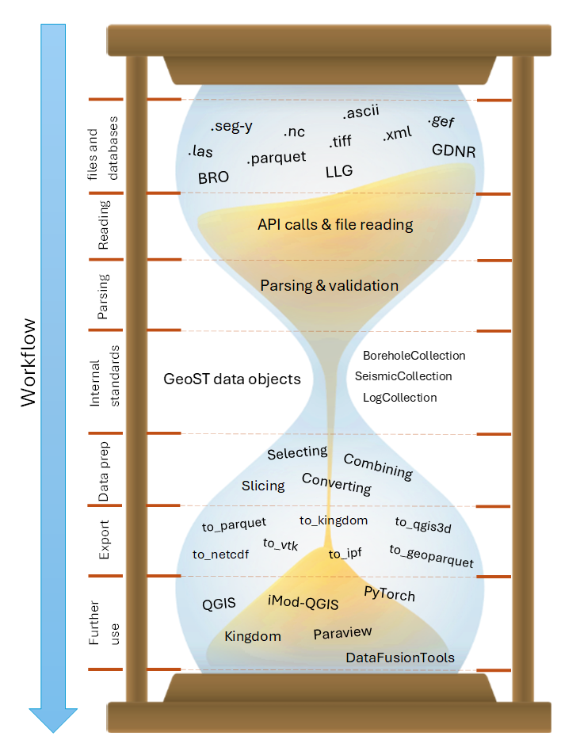

# About GeoST
```{toctree}
---
maxdepth: 2
caption: About
hidden:
---
```

Subsurface data are at the basis of addressing challenges related to levee safety, infrastructure
stability, drinking water extraction, (sand) mining, subsurface energy systems, archaeology, CO₂
storage, subsidence, contamination, and many other topics. Experts use subsurface data to advise
on solutions, visualize and interpret the subsurface in the context of these challenges, and,
most importantly, create tailor-made schematizations of the subsurface that directly serve as
input for calculating and mapping stability, subsidence, groundwater flow, thermal properties,
subsurface resources, and more.

These often complex and high-stakes problems require robust, reproducible, and thoroughly
tested workflows, from subsurface data sources (BRO, GDNR, local files) to, for example,
3D subsurface models. Therefore, Deltares started developing GeoST as a tool to support the
use of subsurface data in Python. It provides convenient ways to access, process, and combine
many different sources of subsurface data by offering frequently used (spatial) selection
functionalities, analytical solutions, and methods for reading and exporting data to
industry-standard third-party software.

As shown in the figure below, GeoST aims to bridge the gap between subsurface data sources
and the analyses, visualisation, and modelling efforts that follow. Simple visualisations
and analyses can be used directly to support expert advice, while subsurface data can also
be used to create more advanced schematizations and models that serve as input for applied
models.

<p align="left">
    
</p>

## Design philosophy

The design of GeoST can best be described as an hourglass. At the top of this hourglass are
the many different sources through which subsurface data are distributed. This information
is read, parsed, validated, and subsequently stored in standardized data objects (the neck
of the hourglass). From there, users can apply basic and commonly used functionality to the
loaded data, such as making selections, combining data, performing conversions, and carrying
out slicing operations.

The results can then be exported in various formats and/or further used in different software
and tools, depending on the task at hand.

At the core of the internal data structures are simple Pandas DataFrames, allowing more
advanced users to go far beyond the standard set of methods offered by GeoST.

<p align="center">
    
</p>

## Current development strategy

GeoST is being developed incrementally based on project needs. This means that every time
we require certain functionality within a project, we identify which part of this
functionality is eligible for addition to GeoST. This part is then developed to the high
coding, testing and documentation standards that we require for GeoST. This may take more
resources at first, but will pay itself of as the developed functionality is reused in
other projects.
