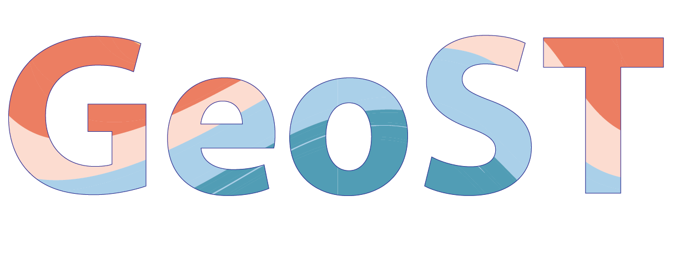

---
html_theme.sidebar_secondary.remove:
---

<p align="center">
    
</p>

# A Python interface for subsurface data
The Geological Subsurface Toolbox (GeoST) package is designed to be an easy-to-use Python
interface for working with subsurface data of The Netherlands, allowing you to integrate
these data in your workflows for data analyses, modelling and visualisation. GeoST readily
provides commonly used methods for e.g. spatial/conditional selections, conversions and data
fusion, but at the same time remains fully flexible for advanced users to develop their own
functions around GeoST data objects.
> **ℹ️ GeoST is a work-in-progress. Not all documentation pages on this website are finished.**
> Use our [GitHub discussions page](https://github.com/Deltares-research/geost/discussions) for questions, support, and suggestions. Issues you come across can be reported [here](https://github.com/Deltares-research/geost/issues).


````{grid} 1 2 2 4
```{grid-item-card}  <i class="fa-solid fa-circle-question"></i>  [About GeoST](about.md)
:text-align: center
```
```{grid-item-card}  <i class="fa-solid fa-play"></i>  [Getting started](getting_started.md)
:text-align: center
```
```{grid-item-card}  <i class="fa-solid fa-book"></i>  [Documentation](documentation.md)
:text-align: center
```
```{grid-item-card}  <i class="fa-solid fa-chalkboard-user"></i>  [Examples](examples.md)
:text-align: center
````

# Package status

[](https://pypi.org/project/geost)
[](https://anaconda.org/channels/conda-forge/packages/geost/overview)
[](https://choosealicense.com/licenses/lgpl-3.0)
[](https://github.com/Deltares-research/geost/actions)
[](https://codecov.io/gh/Deltares-research/geost)
[](https://github.com/charliermarsh/ruff)

```{toctree}
---
hidden:
---

Home <self>
About <about>
Getting started <getting_started>
Documentation <documentation>
Examples <examples>
Community <community>
Changelog <changelog>
```
